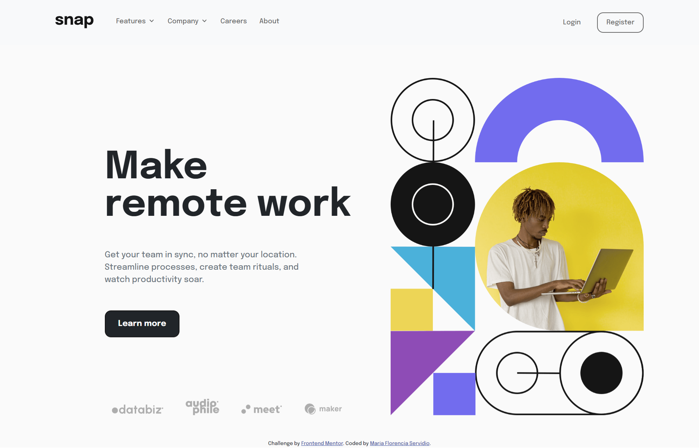
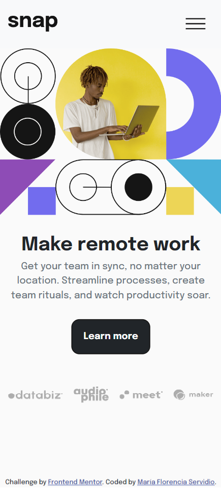

# Frontend Mentor - Intro section with dropdown navigation solution

This is a solution to the [Intro section with dropdown navigation challenge on Frontend Mentor](https://www.frontendmentor.io/challenges/intro-section-with-dropdown-navigation-ryaPetHE5). Frontend Mentor challenges help you improve your coding skills by building realistic projects. 

## Table of contents

- [Overview](#overview)
  - [The challenge](#the-challenge)
  - [Screenshot](#screenshot)
  - [Links](#links)
- [My process](#my-process)
  - [Built with](#built-with)
  - [What I learned](#what-i-learned)
  - [Continued development](#continued-development)
  - [Useful resources](#useful-resources)
- [Author](#author)
- [Acknowledgments](#acknowledgments)


## Overview

### The challenge

Users should be able to:

- View the relevant dropdown menus on desktop and mobile when interacting with the navigation links
- View the optimal layout for the content depending on their device's screen size
- See hover states for all interactive elements on the page

### Screenshot





### Links

- Solution URL: [GitHub repo](https://github.com/Maflo88/intro-section-with-dropdown-navigation)
- Live Site URL: [Vercel](https://intro-section-with-dropdown-navigation-two.vercel.app/)

## My process

### Built with

- Semantic HTML5 markup
- [Bootstrap 5](https://getbootstrap.com/) - CSS Framework
- CSS custom properties
- Mobile-first workflow


### What I learned

In this challenge I decided to use a CSS framework such as Bootstrap for practice purpose. I learned how to implement the layout with its breakpoints and the components of this framework. I was also able to customize and modify the style to adapt it to the project. An example of this is the animation of the dropdown icon, modified by using CSS atribute selector. And with Bootstrap 5 is easier to build an offcanvas menu for mobile devices.

Building of the offcanva menu for mobile devices:

```html
<button class="navbar-toggler" type="button" data-bs-toggle="offcanvas" data-bs-target="#offcanvasNavbar" aria-controls="offcanvasNavbar" aria-expanded="false" aria-label="Toggle navigation">
            <span class="navbar-toggler-icon"></span>
          </button>

          <!-- Offcanvas menu for mobile and tablets -->

          <div class="offcanvas offcanvas-end" tabindex="-1" id="offcanvasNavbar" aria-labelledby="offcanvasNavbarLabel">
            
            <div class="offcanvas-header">
              <button type="button" class="btn-close text-reset" data-bs-dismiss="offcanvas" aria-label="Close"></button>
            </div>

            <div class="offcanvas-body py-1">

                <ul class="navbar-nav justify-content-start flex-grow-1 ps-1 py-1 gap-lg-2">

                  <li class="nav-item dropdown">
                    <a class="nav-link dropdown-toggle" id="dropdownFeatures" href="#" role="button" data-bs-toggle="dropdown" data-bs-auto-close="default" data-bs-display="static" aria-expanded="false">
                      Features<!--<i class="icon-d dropdown-icon" onclick="changeIcon(this)"></i>-->
                    </a>
                    
                    <ul class="dropdown-menu dropdown-menu-end" aria-labelledby="dropdownFeatures">
                      <li><a class="dropdown-item my-2" href="#"><i class="icon-m icon-todo mr-2"></i>Todo List</a></li>
                      <li><a class="dropdown-item my-2" href="#"><i class="icon-m icon-calendar"></i>Calendars</a></li>
                      <li><a class="dropdown-item my-2" href="#"><i class="icon-m icon-reminders"></i>Reminders</a></li>
                      <li><a class="dropdown-item my-2" href="#"><i class="icon-m icon-planning"></i>Planning</a></li>
                    </ul>
                  </li>

                  <li class="nav-item dropdown">
                    <a class="nav-link dropdown-toggle" id="dropdownCompany" href="#" role="button" data-bs-toggle="dropdown" data-bs-auto-close="default" data-bs-display="static" aria-expanded="false">
                      Company <!--<i class="icon-d dropdown-icon" onclick="changeIcon(this)"></i>-->
                    </a>
                    <ul class="dropdown-menu dropdown-menu-start" aria-labelledby="dropdownCompany">
                      <li><a class="dropdown-item my-2" href="#">History</a></li>
                      <li><a class="dropdown-item my-2" href="#">Our team</a></li>
                      <li><a class="dropdown-item my-2" href="#">Blog</a></li>
                    </ul>
                  </li>

                  <li class="nav-item">
                    <a class="nav-link" href="#">Careers</a>
                  </li>

                  <li class="nav-item">
                    <a class="nav-link" href="#">About</a>
                  </li>
                </ul>

                <!-- Mobile login buttons-->

                <div class="d-lg-none d-grid gap-2 mt-3">
                    <button class="btn btn-sm text-secondary d-sm-block p-2" type="button">Login</button>
                    <button class="btn btn-sm btn-outline-secondary d-sm-block p-2" type="button">Register</button>
                </div>

                <!-- Desktop login button -->

                <div class="d-none d-lg-flex align-content-center justify-content-end py-1 gap-4">
                  <a class="nav-link align-self-center login px-2 py-1" type="button">Login</a>
                  <button class="btn btn-outline-secondary d-inline-block px-3 py-2" type="button">Register</button>
                </div>

            </div>
```

Styling and animation of the dropdown icon:

```css
.dropdown-toggle:after {
    display: inline-block;
    content: "";
    background-image: url('../images/icon-arrow-down.svg');
    background-repeat: no-repeat;
    width: .75rem;
    height: .5rem;
    margin-left: 0.255em;
    border: none;
    vertical-align: baseline;
    background-color: transparent;
    overflow: hidden !important;
    transform-origin: center;
}

/*selecting the atribute when the icon changes*/
.dropdown-toggle[aria-expanded="true"]:after {
    transform: rotate(180deg);
}

/*for the animation*/
.dropdown-toggle:after {
    transition: 0.15s ease-in-out;
}

.dropdown-toggle:hover:after, .dropdown-toggle:focus:after{
    filter: invert(0%) sepia(4%) saturate(36%) hue-rotate(331deg) brightness(38%) contrast(84%);
}
```

### Continued development

For future projects I looking to improve my Bootstrap skill and solve challenges integrating Javascript codes. I would also like to learn other frameworks such as Tailwind CSS.

### Useful resources

- [Bootstrap 5 Docs](https://getbootstrap.com/docs/5.1/getting-started/introduction/) - This helped me understand how to implement the components and elements of the framework
- [Change Color of SVG on Hover](https://css-tricks.com/change-color-of-svg-on-hover/) - This is an amazing article which helped me understand how to change color of a SVG icon set as a background image.
- [Stack overflow](https://stackoverflow.com/questions/47175786/rotate-bootstrap-dropdown-caret-on-toggle-and-prevent-close-if-clicked-inside) - The response to this question help me how to implement the animation of the dropdown icon.

## Author

- Behance - [María Florencia Servidio](https://www.behance.net/mflorservidio88)
- Frontend Mentor - [@Maflo88](https://www.frontendmentor.io/profile/Maflo88)

## Acknowledgments

Thanks to CSS-Tricks for their amazing articles and tutorial and Stack overflow for helping beginner programmers.
And thanks to Frontend Mentor for their awesome challenges.
